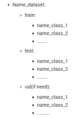

<h1>How to run this repository<h1>
  <h3>For training</h3>
  
+Step0: Dowload data you need to classification, the struct of folder contain data to classification like this

  </img>
  
+Step1: Go to "data" folder then create another file .yaml like dog_cat.yaml

  
+Step2: Open CMD, terminal, anaconda prompt

  
+Step3: Clone this repository

  <pre>git clone https://github.com/LuongTuanAnh163002/Resnet_AnhLT.git</pre>
  
+Step4: Move to the Web_Sign_Language_Detection folder

  <pre>cd Resnet_AnhLT</pre>
  
+Step5: Install all packges need

  <pre>pip install -r requirements.txt</pre>
  
+Step6: Run the code below to training for pretrain

  <pre>python train.py --model_type [resnet18, resnet34, resnet50, resnet101, resnet152] --pretrained --freeze --data file_name.yaml --epochs 50 --device 0</pre>
  
+Step7: Run the code below to training for weight initialize

  <pre>python train.py --model_type [resnet18, resnet34, resnet50, resnet101, resnet152] --data file_name.yaml --epochs 50 --device 0</pre>
  
+Step8: Run the code below to training for using weight from previous train

  <pre>python train.py --model_type [resnet18, resnet34, resnet50, resnet101, resnet152] --weight_init [file_name.pt, file_name.pth] --data file_name.yaml --epochs 50 --device 0</pre>
  
After you run and done training, all results save in runs/train/exp/..., folder runs automatic create after training done:

  <h3>For detect</h3>
  
+Detect for file

  <pre>python detect.py --source file_name.jpg --weights ../runs/train/../weights/__.pth --device 0</pre>
  
+Detect for folder

  <pre>python detect.py --source path_folder --weights ../runs/train/../weights/__.pth --device 0</pre>
